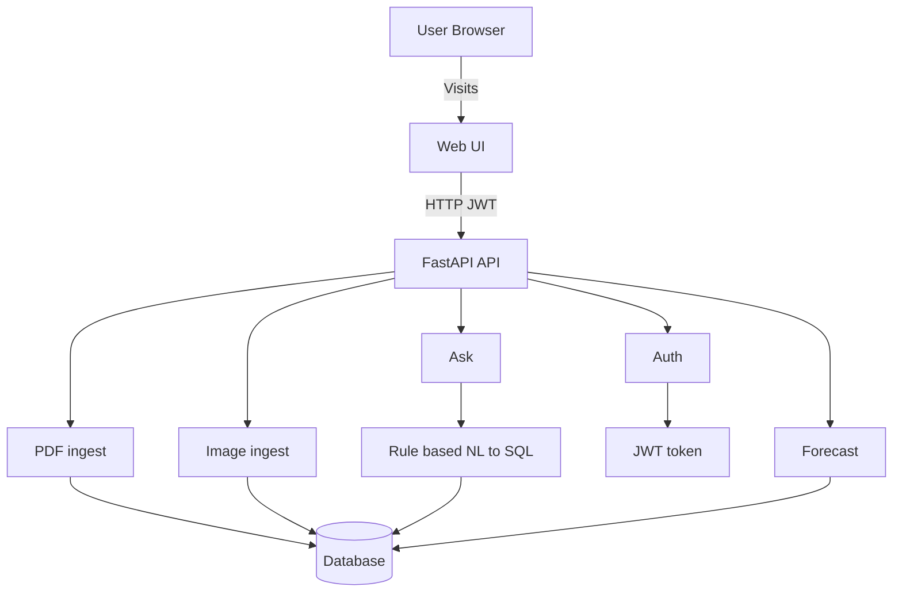

# Asklytics

Asklytics is a full-stack financial analytics app: ingest financial data (PDF/image), explore it in a React dashboard, and query it via a chat-style interface that returns validated SQL results.

Repository: [github.com/yuvraj20gole/Asklytics](https://github.com/yuvraj20gole/Asklytics)

---

## Features

- **Auth**: JWT-based register/login.
- **Chat analytics**: `/ask` uses **rule-based NL → SQL** with validation and safe execution.
- **PDF ingest**: extract and validate financial tables from PDFs.
- **Image ingest**: OCR-based extraction pipeline (EasyOCR + layout fallback).
- **Forecasting**: simple PyTorch MLP revenue forecast over ingested series.

---

## Architecture



---

## Tech stack

- **Backend:** Python, FastAPI, SQLAlchemy, Pydantic, Uvicorn
- **Web:** React + TypeScript + Vite
- **Data:** SQLite by default; PostgreSQL via `DATABASE_URL`
- **ML/OCR:** PyTorch, EasyOCR, OpenCV

---

## Getting started

### Prerequisites

- **Python** 3.11+ (3.12 recommended; use a **native arm64** interpreter on Apple Silicon).
- **Node.js** 18+ and npm (for `web/`).

### Backend + Web (local dev)

```bash
git clone https://github.com/yuvraj20gole/Asklytics.git
cd Asklytics
python3 -m venv .venv
source .venv/bin/activate   # Windows: .venv\Scripts\activate
pip install -r backend/requirements.txt
```

Create `.env` at the repo root:

```bash
cp .env.example .env
```

Start the API:

```bash
PYTHONPATH=backend uvicorn app.main:app --reload --host 0.0.0.0 --port 8000
```

Start the web app:

```bash
cd web
npm install
VITE_API_BASE="http://localhost:8000" npm run dev
```

API docs: [http://localhost:8000/docs](http://localhost:8000/docs)  
Web: the URL Vite prints (commonly `http://localhost:5173`)

---

## Environment variables (backend)

- **`JWT_SECRET_KEY`**: required.
- **`DATABASE_URL`**: defaults to SQLite; set for PostgreSQL.
- **`CORS_ALLOW_ORIGINS`**: comma-separated frontend origins (no spaces), e.g. `https://your-site.com`.

---

## Deployment (Render)

1. [Render Dashboard](https://dashboard.render.com) → **New** → **Blueprint** → connect this repo (uses root **`render.yaml`**).
2. When the **API** service is live, copy its URL (e.g. `https://asklytics-api.onrender.com`).
3. Open the **static web** service → **Environment** → set **`VITE_API_BASE`** to that URL (no trailing slash) → **Manual Deploy**.
4. Open the **API** service → set **`CORS_ALLOW_ORIGINS`** to your **exact** frontend origin (e.g. `https://asklytics-web.onrender.com`). Comma-separate multiple origins if needed.
5. **`JWT_SECRET_KEY`** is auto-generated in the blueprint unless you override it in the API service.

---

## API overview (prefix `/api/v1`)

| Area | Notes |
|------|--------|
| **Auth** | `POST /auth/register`, `POST /auth/login` → JWT. |
| **Ask** | `POST /ask` — natural language → validated SQL → rows + explanation (requires auth). |
| **PDF ingest** | `POST /ingest/pdf` — multipart form: `company`, `file` (PDF). |
| **Image ingest** | `POST /ingest/image` — multipart form: `company`, image (`.jpg`/`.jpeg`/`.png`); full extraction pipeline under active development. |
| **Forecast** | `GET /ml/revenue-forecast` — PyTorch MLP on ingested revenue facts (requires prior PDF ingest data). |

---

## Troubleshooting

- **Database errors after schema changes:** stop the API, delete `local.db`, restart (dev only — destroys local data).
- **CORS:** the API allows Vite dev origins on `localhost` ports `517x` (see `backend/app/main.py`).
- **Secrets:** never commit `.env`; it is listed in `.gitignore`.

---

## Development notes

- **`debug_output/`** is ignored by Git — use it locally for OCR/PDF debug artifacts.
- **EasyOCR** downloads model weights on first use (~tens of MB).

---

## License

No license file is included yet; add one (e.g. MIT) if you plan to distribute the project.
